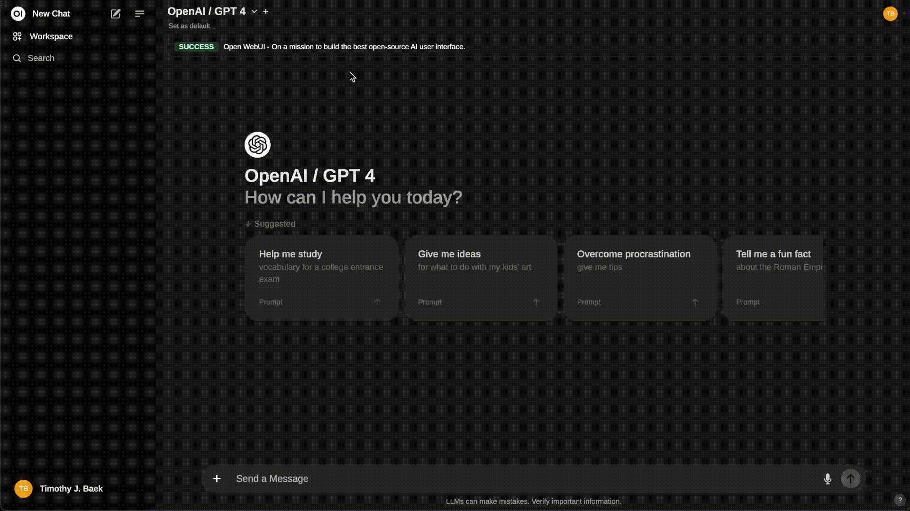

# Ollama Tutorial

## Setup

Use docker to run [ollama](https://ollama.com/) and [webui](https://github.com/open-webui/open-webui)

```sh
docker compose up -d
```

## Load Model

```sh
docker compose exec -it ollama ollama run llama3.1:8b # or llama3.1:70b
```

## List All Models

```sh
docker compose exec -it ollama ollama list
```

## Chat Dashboard

Go to <http://localhost:8080>


